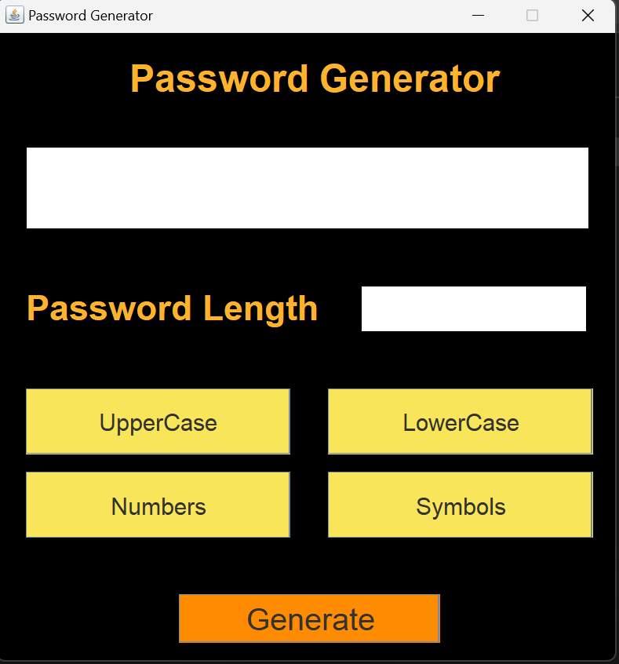
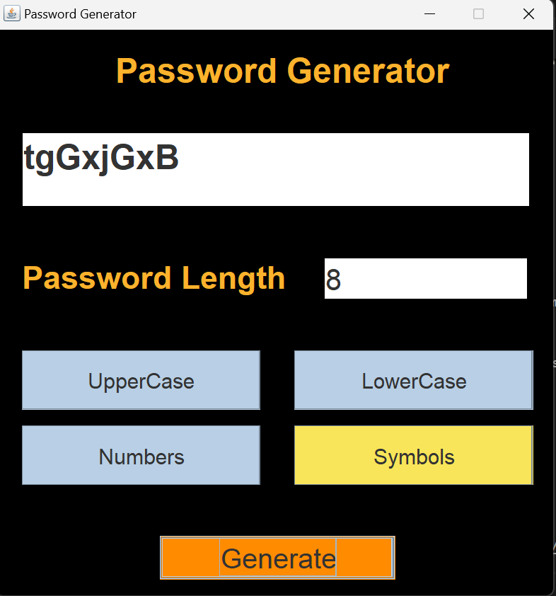

# 🔐 Password Generator GUI

A secure, intuitive desktop application built in **Java** that generates cryptographically random passwords. This tool allows for full customization of password complexity to meet modern security standards.

---

## 🚀 Quick Start (Executable)

For most users, there is no need to compile code.

1. **Download** the latest `PasswordGeneratorGUI.jar` from the [Releases](https://github.com/SarahJobyDavid/Password_Generator/releases/tag/v1.0.0) page.
2. **Ensure** you have [Java 8 or higher](https://www.oracle.com/java/technologies/downloads/) installed.
3. **Run** the application by double-clicking the `.jar` file.

---

## 📸 Preview & Demo

| Initial State | Password Generated |
| :---: | :---: |
|  |  |
| *Clean, high-contrast interface* | *Real-time generation in action* |
---

## ✨ Features

* **Custom Length:** Specify exact password length requirements.
* **Granular Complexity:** Toggle between Uppercase, Lowercase, Numbers, and Symbols to satisfy specific site requirements.
* **Instant Generation:** Real-time generation with a single click.
* **Input Validation:** Built-in logic ensures at least one character set is selected and length is valid before generation.
* **Scrollable Output:** Easy viewing of long, complex strings.

---

## 🛠️ Developer Instructions

If you wish to modify or build the project from the source:

### Prerequisites

* JDK 8 or higher.

### Build and Run

```bash
# Clone the repository
git clone https://github.com/SarahJobyDavid/Password_Generator.git

# Navigate to the project directory
cd Password_Generator

# Compile the source files
javac src/*.java -d out/

# Run the application
java -cp out App

```

---

## 🧰 Tech Stack & Architecture

| Component | Technology |
| --- | --- |
| **Language** | Java 8+ |
| **GUI Framework** | Swing / AWT |
| **Logic** | Random Character Pooling & Validation |
| **Packaging** | Executable JAR Artifact |

### Project Structure

* `App.java`: The entry point that initializes the UI.
* `PasswordGeneratorGUI.java`: Handles the layout, event listeners, and user interaction.
* `PasswordGenerator.java`: Contains the core logic for generating random strings based on user-defined constraints.

---

## 📂 Project Links

* **Repository:** [https://github.com/SarahJobyDavid/Password_Generator](https://github.com/SarahJobyDavid/Password_Generator)
* **Latest Release:** [Download JAR](https://github.com/SarahJobyDavid/Password_Generator/releases/tag/v1.0.0)
---

